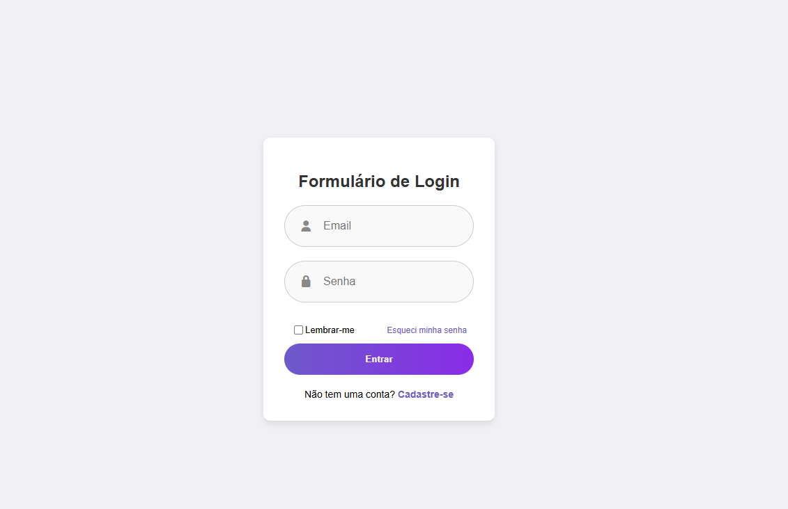
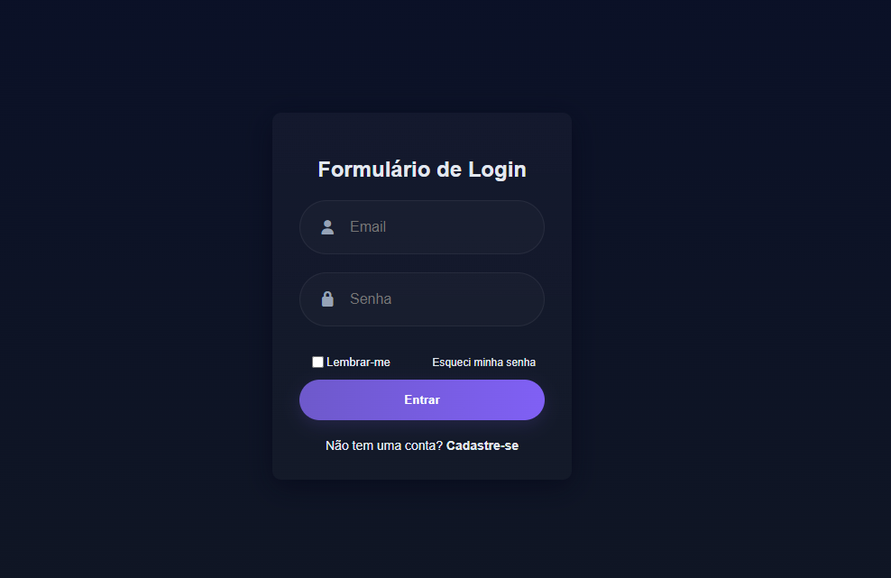

# 🖤 Formulário de Login com Modo Escuro

Um projeto simples de **formulário de login responsivo** com **ícones do Font Awesome** e **modo escuro (dark mode)** ativado por um botão.

## 🧩 Tecnologias utilizadas

* **HTML5** – estrutura da página
* **CSS3** – estilização e modo escuro
* **Font Awesome** – ícones personalizados
* **JavaScript** – alternância entre os modos claro e escuro

## 💡 Funcionalidades

✅ Campo de **email** e **senha** com ícones
✅ Opção **"Lembrar-me"** e link de **recuperação de senha**
✅ Botão de **cadastro** para novos usuários
✅ Botão com ícone de **olho** para ativar o **modo escuro/claro**
✅ Layout **limpo, moderno e responsivo**

## 🖥️ Pré-visualização





## ⚙️ Como usar

1. Baixe ou clone este repositório:

   ```bash
   git clone https://github.com/MikaelMelo1/pagina-login
   ```
2. Abra o arquivo `index.html` no seu navegador.
3. Clique no ícone de **olho** para alternar entre **modo claro** e **escuro** 🌗

## 🎨 Personalização

* Edite o arquivo `styles.css` para mudar cores, fontes e espaçamento.
* Altere o texto e links dentro do HTML conforme necessário.

## 📸 Exemplo de comportamento

🕶️ Clique no botão “olho” → Ativa o **modo escuro**
🌞 Clique novamente → Volta para o **modo claro**

## 📂 Estrutura do projeto

```
/
├── index.html
├── styles.css
└── README.md
```

#